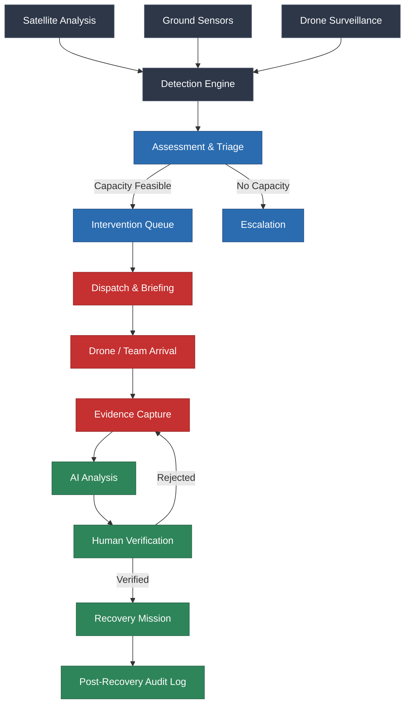
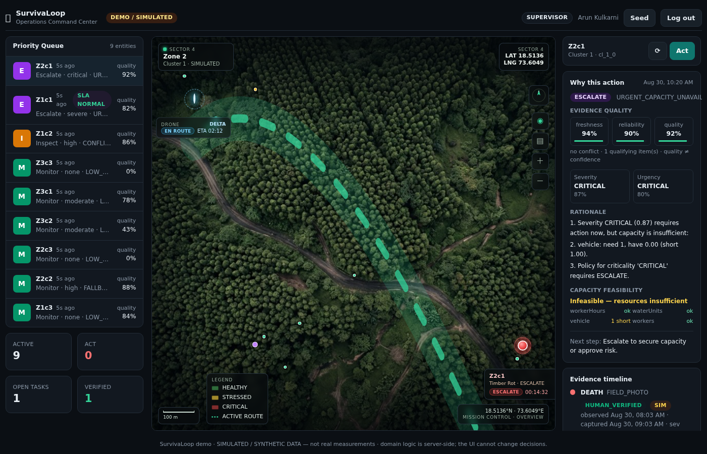
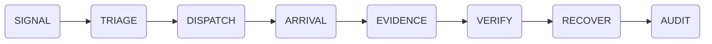

<div align="center">
  <h1>SURVIVALOOP</h1>
  <p><b>Environmental Intelligence & Response Platform</b></p>
  <p>Detect → Decide → Dispatch → Verify → Recover</p>
  <br />
  
  
</div>

<div align="center">
  
  <!-- Badges -->
  
  
  
  
  
  

</div>

---

## ⚡ Explore

- [The Problem](#-the-problem)
- [End-to-End System Flow](#-end-to-end-system-flow)
- [Platform Walkthrough](#-platform-walkthrough)
- [Living Forest GIS](#-living-forest-gis)
- [Technical Architecture](#-technical-architecture)
- [Getting Started](#-getting-started)

---

## 🌲 The Problem

Environmental threats are detected long before teams can physically respond. The critical gap is not knowing *what* is happening, but *who* should do *what* about it—and ensuring it gets done.

SurvivaLoop turns fragmented signals into an actionable intervention workflow, creating a verifiable loop of accountability.

<pre>
Satellite Signal
      ↓
AI Detection
      ↓
Risk Prioritization
      ↓
Autonomous Dispatch
      ↓
Evidence Verification
      ↓
Human Authorization
      ↓
Recovery
</pre>

---

## 🔄 End-to-End System Flow



---

## 🎥 Platform Walkthrough

| 🌐 Command Center | 🌲 Intervention Selection |
|:---:|:---:|
|  |  |
| **Living Forest Command Center:** The geographic mission environment provides spatial context for intervention decisions. | **Intervention Queue & Details:** Selecting an anomaly displays the server-authoritative evidence, capacity check, and justification. |

*(More screenshots capturing the Verification Timeline and Post-Recovery Audit will be documented here as UI modules are refined.)*

---

## 🌲 Living Forest GIS

The map isn't decoration. It is the operational context.

Rather than generic dashboards of disconnected metrics, the command center revolves around a spatial reality. Currently operating with a pure SVG spatial projection, the GIS system allows operators to understand threats in context:
- **Forestry Basemap**: Shows terrain, topography, and access routes.
- **Intervention Markers**: Highlights priority anomalies (e.g., MC-07 critical states).
- **Spatial Clustering**: Groups close proximity issues.
- **Drone Routes**: Visualizes calculated approach paths for Drone Delta units.

<div align="center">
  
</div>

---

## 📖 The Mission Story



1. **Signal**: Raw environmental anomaly data enters the system.
2. **Triage**: Deterministic evaluation of SLA, capacity, and threat severity.
3. **Dispatch**: The task is committed to the field worker or Drone Delta unit.
4. **Arrival**: Unit approaches coordinates.
5. **Evidence**: Captured field imagery and sensor data.
6. **Verify**: Supervisor conducts a strict human-in-the-loop validation of the AI findings.
7. **Recover**: The intervention execution phase.
8. **Audit**: Immutable, append-only record of every decision and action.

---

## 🏛️ Technical Architecture

The architecture enforces a strict separation of concerns, where business logic is entirely decoupled from the presentation layer.


> **Important**: The UI *never* makes decisions or trusts client roles/timestamps. It is a pure reflection of the server's truth.

---

## ⚙️ Technology Stack

**Frontend**
- Next.js 14
- React 18
- Tailwind CSS

**Backend**
- Next.js API Routes (Serverless deployment ready)
- Zod (Strict boundary validation)
- JSON Web Tokens (JOSE for stateless auth)

**Database / Data Layer**
- SQLite (`better-sqlite3`) for local deterministic sandboxing.
- (Production targets PostgreSQL/PostGIS)

---

## 📁 Project Structure

```text
survivaloop-operations-command-center/
├── docs/                 # Schema definitions, design docs, and showcase assets
│   └── screenshots/      # Product images
├── src/
│   ├── app/              # Next.js App Router (UI & API endpoints)
│   ├── components/       # Reusable React UI components
│   ├── data/             # SQLite repository adapters
│   ├── domain/           # Pure business logic (engine, capacity, SLA, validation)
│   ├── lib/              # Shared utilities
│   ├── server/           # Request auth, runtime singletons
│   └── services/         # Orchestrators bridging API to Domain
├── tests/                # Node.js deterministic test suite
├── .env.example          # Environment configuration template
├── package.json          # Node dependencies
└── README.md             # This document
```

---

## 🚀 Getting Started

### Requirements
- Node.js (v20+ recommended)
- Appropriate C++ compilation tools for `better-sqlite3` native bindings (e.g., Visual Studio Desktop Development with C++ on Windows, or `build-essential` on Linux).

### Installation
Clone the repository and install dependencies:
```bash
git clone https://github.com/vignesh06-OG/survivaloop-operations-command-center.git
cd survivaloop-operations-command-center
npm install
```

### Environment
Copy the example environment file and configure it:
```bash
cp .env.example .env
```
Ensure you set `SURVIVALOOP_JWT_SECRET`. **Never commit `.env` to version control.**

### Development
Start the local development server:
```bash
npm run dev
```
The app runs at `http://localhost:3000`. It will self-seed a deterministic simulated environment.

### Testing
```bash
npm run typecheck    # Strict TypeScript checks
npm test             # Run the full test suite
```

### Production Build
```bash
npm run build
```

---

## 🧭 Prototype Status

**████████████████░░░░  ~80%**

### Complete
- [x] Command Center Interface
- [x] Deterministic Decision Engine
- [x] Task Lifecycle State Machine
- [x] Server-side Security & RBAC
- [x] SQLite Runtime Data Layer
- [x] Living Forest GIS (SVG Prototype)

### In Progress
- [ ] Integration of MapLibre GL for production GIS.
- [ ] Resolving cross-platform native compilation requirements for local builds.

### Planned
- [ ] Integration of Three.js and custom shaders for 3D Drone dispatch animations.
- [ ] Mobile Field Execution view refinement.

---

## 🛤️ Roadmap

### Phase 01 — Command Center
- [x] Mission Control
- [x] GIS Basics
- [x] Intervention Queue

### Phase 02 — Response
- [x] Triage & Dispatch Automation
- [x] Verification Rules
- [ ] Realistic Drone Visualization (Three.js)

### Phase 03 — Field Operations
- [ ] Mobile Field Execution PWA
- [ ] Offline-first Synchronization

### Phase 04 — Intelligence
- [ ] Regional Analytics
- [ ] Long-term survival trends

---

## 🎨 Design Language

- **Dark cinematic environment**: Reduces eye strain for operators in low-light environments.
- **High information density**: Ensures complex, multi-layered data is accessible without endless clicking.
- **Geographic-first interaction**: If it exists in the physical world, it is managed on the map.
- **Minimal visual noise**: Functional over flashy.
- **Operational status through color**: Strict semantic color coding (e.g., Red = Critical/Escalated).
- **Human authority over automated decisions**: AI suggests and correlates, but humans verify and authorize.

---

## 💡 Why This is Different

Unlike generic BI dashboards or passive monitoring tools, SurvivaLoop is an **intervention workflow engine**. 

It prioritizes geographic context over charts, actively demanding resolution rather than just reporting anomalies. By enforcing a deterministic, capacity-aware dispatch loop and a strict human-in-the-loop verification model, it ensures that every environmental threat is not just seen, but verifiably mitigated. There is no "black box" AI scoring here—every decision is explainable, accountable, and permanently audited.
