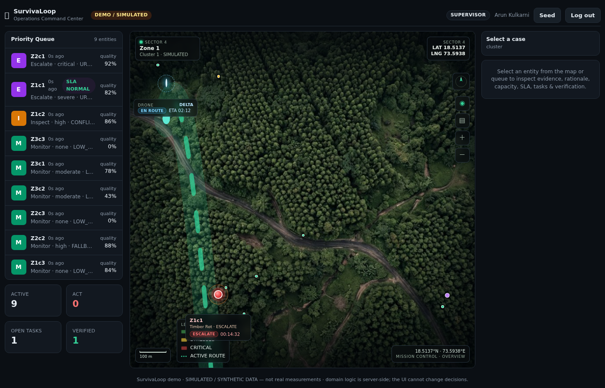
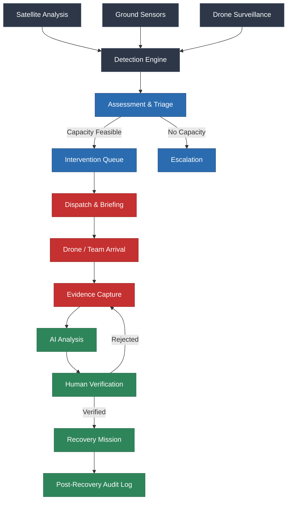

<div align="center">
  
  
  
  
</div>

<div align="center">
  <h1>SURVIVALOOP</h1>
  <p><b>Detect → Decide → Dispatch → Verify → Recover</b></p>
  <p><i>India's capacity-aware tree survival and environmental response system.</i></p>
  <br />
  
  
</div>

---

## 🔴 Live Demo
Experience the SurvivaLoop platform live. The environment runs on a deterministic, pre-seeded simulation for evaluation purposes.

**URL**: [https://survivaloop.vercel.app/](https://survivaloop.vercel.app/)

### Demo Logins
Simply click on the role card in the login screen to automatically authenticate:
- **Admin**: Full system oversight and configuration.
- **Supervisor**: Triage interventions, manage queues, and override AI decisions.
- **Field Worker**: Mobile-first execution view for field personnel.
- **Auditor**: Read-only access to the post-recovery audit trail.

> **Note**: The live demo uses simulated environmental anomaly data. 

---

## ⚡ Quick Start
Get SurvivaLoop running locally in less than 2 minutes.

```bash
# 1. Clone the repository
git clone https://github.com/vignesh06-OG/survivaloop-operations-command-center.git
cd survivaloop-operations-command-center

# 2. Install dependencies
npm install

# 3. Configure environment
cp .env.example .env

# 4. Start the development server
npm run dev
```

Open [http://localhost:3000](http://localhost:3000) in your browser.

> **Note**: For local development, SurvivaLoop runs entirely on a sandboxed `better-sqlite3` deterministic database. No cloud database configuration is required.

---

## 🌲 The Problem
Environmental threats are detected long before teams can physically respond. The critical gap is not knowing *what* is happening, but *who* should do *what* about it—and ensuring it gets done before capacity runs out.

SurvivaLoop turns fragmented signals into an actionable intervention workflow, creating a verifiable loop of accountability.

<pre>
Satellite Signal
      ↓
AI Detection
      ↓
Risk Prioritization
      ↓
Autonomous Dispatch
      ↓
Evidence Verification
      ↓
Human Authorization
      ↓
Recovery
</pre>

---

## 🔄 End-to-End System Flow



---

## 🏛️ Technical Architecture

The architecture enforces a strict separation of concerns, where business logic is entirely decoupled from the presentation layer.


> **Important**: The UI *never* makes decisions or trusts client roles/timestamps. It is a pure reflection of the server's truth.

---

## 🎨 Design Language

- **Dark cinematic environment**: Reduces eye strain for operators in low-light environments.
- **High information density**: Ensures complex, multi-layered data is accessible without endless clicking.
- **Geographic-first interaction**: If it exists in the physical world, it is managed on the map.
- **Minimal visual noise**: Functional over flashy.
- **Operational status through color**: Strict semantic color coding (e.g., Red = Critical/Escalated).
- **Human authority over automated decisions**: AI suggests and correlates, but humans verify and authorize.

---

## 💡 Why This is Different

Unlike generic BI dashboards or passive monitoring tools, SurvivaLoop is an **intervention workflow engine**. 

It prioritizes geographic context over charts, actively demanding resolution rather than just reporting anomalies. By enforcing a deterministic, capacity-aware dispatch loop and a strict human-in-the-loop verification model, it ensures that every environmental threat is not just seen, but verifiably mitigated. There is no "black box" AI scoring here—every decision is explainable, accountable, and permanently audited.
